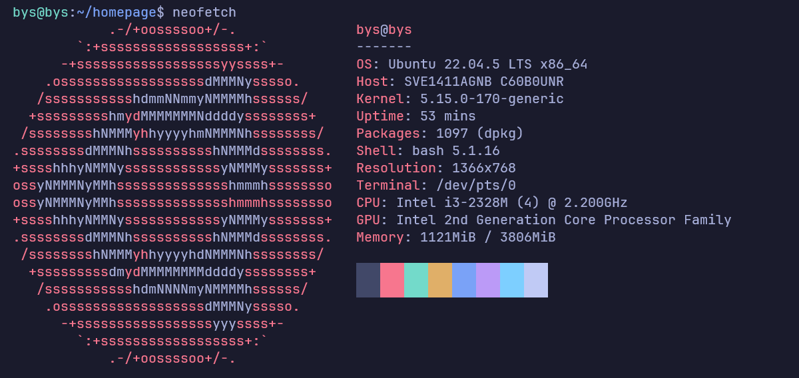
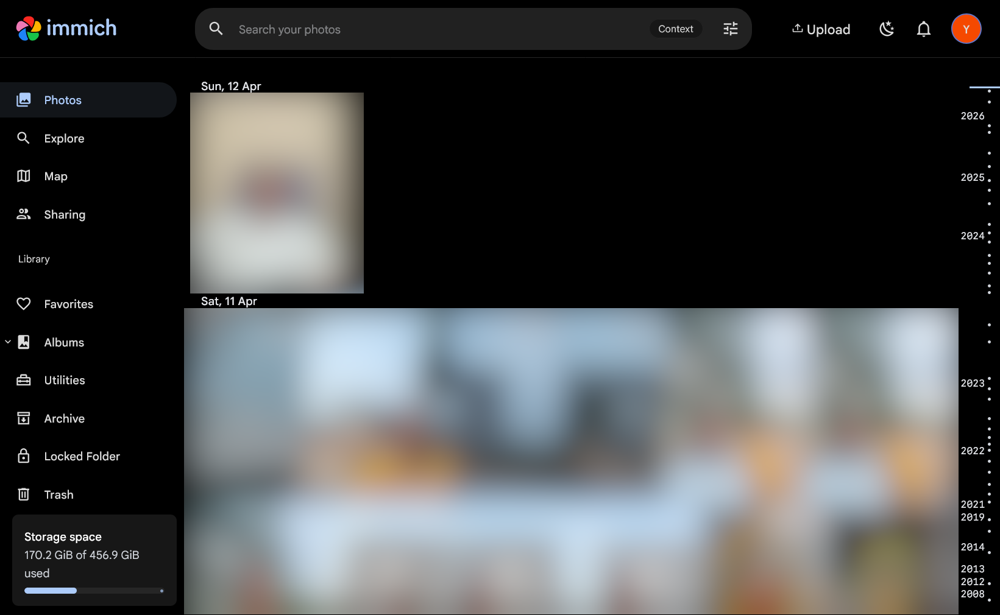
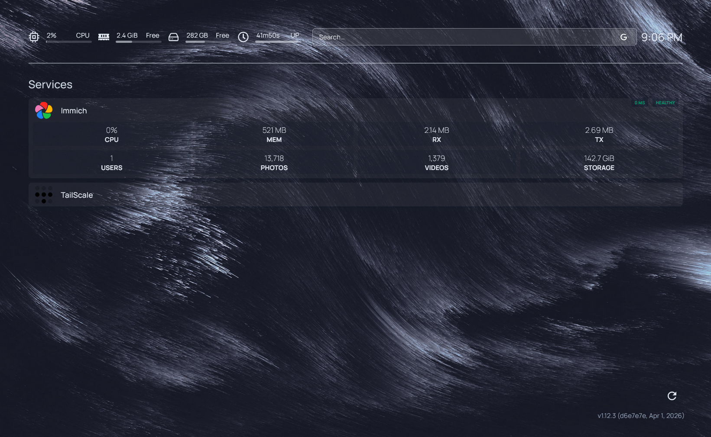

# 🏠 Personal Homelab

A self-hosted homelab running on an old laptop repurposed as a home server. Built to replace cloud services with privacy-respecting, locally-hosted alternatives, accessible from anywhere via a secure VPN tunnel.

---

## Information about laptop

- Got the laptop 10 years ago (very old)
- Model: Sony vaio (You probably never heard of this because it's very old and discontinued now xD)
- It has 512gb HDD Storage
- Some other information in the neofetch below:-
- 

---

## Why did i do this

I always saw youtube videos about self hosting and got interested in it. I had tons of personal photos (~around 150gb of photos) in my external hard drive and i wanted get access to them anywhere in my mobile/laptop so i got immich in my old laptop.

---

## Services i used

| Service       | Purpose                                                                  | Tech            |
| ------------- | ------------------------------------------------------------------------ | --------------- |
| **Immich**    | Self-hosted photo & video backup (Google Photos open source alternative) | Docker          |
| **Homepage**  | Unified dashboard for all services (Displays all services in my server)  | Docker          |
| **Tailscale** | Secure remote access via VPN mesh network (Can use immich anywhere)      | WireGuard-based |
| **Immich ML** | Lets me run machine learning models of photos on a more powerful device  | Docker          |

---

## Architecture

```
                        ┌─────────────────────────────────┐
                        │         Old Laptop Server       │
                        │         (Ubuntu Server)         │
                        │                                 │
  Local Network  ──────▶│  :2283  Immich                  │
                        │  :3000  Homepage Dashboard      │
                        │                                 │
                        │  ┌─────────────────────────┐    │
                        │  │        Docker           │    │
                        │  │  immich-server          │    │
                        │  │  immich-machine-learning│    │
                        │  │  postgres               │    │
                        │  │  redis (valkey)         │    │
                        │  └─────────────────────────┘    │
                        │                                 │
                        │  Tailscale (VPN mesh)           │
                        └───────────────┬─────────────────┘
                                        │
                        ┌───────────────▼─────────────────┐
                        │       Tailscale Network         │
                        │   Access from phone / laptop    │
                        │     anywhere in the world       │
                        └─────────────────────────────────┘
```

---

## More info on services used

### Immich

A full-featured, self-hosted photo and video backup solution. Replaces Google Photos completely.

- Automatic mobile backup
- Face recognition and person tagging (runs on-device via the ML container)
- Smart search powered by CLIP embeddings
- Timeline view, albums, shared libraries
- Runs as 4 coordinated containers: server, machine learning, postgres, redis

**Access:** `http://<server-ip>:2283` on local network, or via Tailscale IP from anywhere



### Homepage Dashboard

A clean, customizable dashboard that shows all running services in one place.

- Live status indicators for each service
- Quick-access links to all self-hosted apps
- Configured via YAML files

**Access:** `http://<server-ip>:3000`



### Tailscale

Tailscale creates a secure WireGuard-based mesh VPN between devices. This means the home server is reachable from anywhere — phone, laptop, college — without exposing any ports to the public internet.

- No open ports on the home router
- End-to-end encrypted traffic
- Works behind CGNAT (most Indian ISPs (i hate you airtel))

---

## This project taught me:

- **Linux server administration** — managing a headless Ubuntu Server
- **Docker & containerization** — running and coordinating multiple containers with Docker Compose
- **Networking** — local network access, port mapping, and VPN-based remote access with Tailscale
- **Service dependencies** — understanding how Immich's server, ML, database, and cache containers depend on each other
- **Self-hosting** — the full lifecycle of deploying, maintaining, and accessing a production-like service

---

## References

- [Immich Documentation](https://docs.immich.app)
- [Tailscale Documentation](https://tailscale.com/kb)
- [Docker Documentation](https://docs.docker.com)
